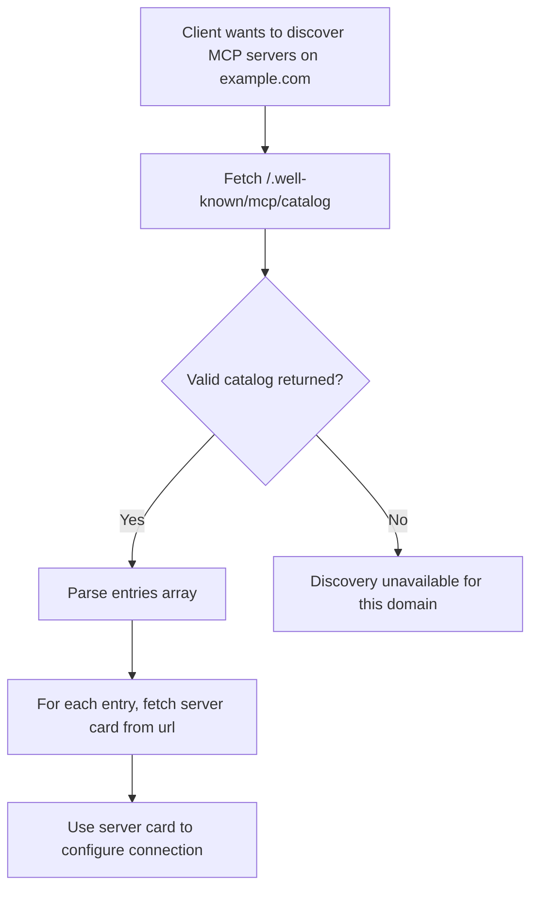

<div id="enable-section-numbers" />

<Info>**Protocol Revision**: draft</Info>

MCP defines a discovery mechanism that enables clients to find available MCP servers on a
domain without prior configuration. This mechanism complements the
[lifecycle](/specification/draft/basic/lifecycle) handshake by answering _where_ to
connect, before the protocol establishes _how_ to communicate.

## MCP Catalog

An **MCP Catalog** is a JSON document that lists the MCP server cards available from a
given host. Clients can fetch this document to discover all MCP servers a domain offers,
and then retrieve individual [server cards](https://github.com/modelcontextprotocol/modelcontextprotocol/pull/2127)
for connection details.

The MCP Catalog format is a minimal, MCP-scoped subset of the
[AI Catalog](https://github.com/Agent-Card/ai-catalog) specification. This alignment
ensures that MCP Catalog entries can be used as-is within a full AI Catalog document,
enabling a smooth migration path when the cross-protocol AI Catalog standard is finalized.

### Well-Known URI

Hosts that serve MCP servers SHOULD publish an MCP Catalog at:

```
/.well-known/mcp/catalog
```

This endpoint:

- MUST be accessible via HTTPS (HTTP MAY be supported for local/development use)
- MUST return `Content-Type: application/json`
- MUST include appropriate CORS headers (see [CORS Requirements](#cors-requirements))
- SHOULD include appropriate caching headers (see [Caching](#caching))

### Catalog Format

An MCP Catalog document is a JSON object that MUST contain the following members:

| Member        | Type   | Required | Description                                                 |
| :------------ | :----- | :------- | :---------------------------------------------------------- |
| `specVersion` | string | Yes      | The version of the MCP Catalog format (currently `"draft"`) |
| `entries`     | array  | Yes      | An array of Catalog Entry objects. This array MAY be empty. |

#### Catalog Entry

Each entry in the `entries` array describes a single MCP server and MUST contain:

| Member        | Type   | Required | Description                                                                      |
| :------------ | :----- | :------- | :------------------------------------------------------------------------------- |
| `identifier`  | string | Yes      | A URI or URN identifying this server (e.g., `urn:mcp:server:example/weather`)    |
| `displayName` | string | Yes      | A human-readable name for the server                                             |
| `mediaType`   | string | Yes      | The media type of the referenced artifact. MUST be `application/mcp-server+json` |
| `url`         | string | Yes      | URL where the full server card can be retrieved                                  |

The following members are OPTIONAL:

| Member        | Type     | Required | Description                                                        |
| :------------ | :------- | :------- | :----------------------------------------------------------------- |
| `description` | string   | No       | A short description of the server's capabilities                   |
| `tags`        | string[] | No       | Keywords for filtering and discovery (e.g., `["search", "api"]`)   |
| `version`     | string   | No       | The version of the server. Semantic versioning is RECOMMENDED      |
| `updatedAt`   | string   | No       | An ISO 8601 timestamp indicating when this entry was last modified |

### Example: Single Server

A domain hosting a single MCP server:

```json
{
  "specVersion": "draft",
  "entries": [
    {
      "identifier": "urn:mcp:server:example.com/weather",
      "displayName": "Weather Service",
      "mediaType": "application/mcp-server+json",
      "url": "https://example.com/.well-known/mcp-server-card",
      "description": "Provides weather forecasts and current conditions.",
      "tags": ["weather", "forecast"],
      "version": "1.2.0"
    }
  ]
}
```

### Example: Multiple Servers

A domain hosting several MCP servers, each with its own server card:

```json
{
  "specVersion": "draft",
  "entries": [
    {
      "identifier": "urn:mcp:server:acme.com/code-review",
      "displayName": "Code Review Assistant",
      "mediaType": "application/mcp-server+json",
      "url": "https://acme.com/.well-known/mcp-server-card/code-review",
      "description": "AI-powered code review for pull requests.",
      "tags": ["code-review", "developer-tools"],
      "version": "2.1.0",
      "updatedAt": "2026-04-01T10:00:00Z"
    },
    {
      "identifier": "urn:mcp:server:acme.com/docs-search",
      "displayName": "Documentation Search",
      "mediaType": "application/mcp-server+json",
      "url": "https://acme.com/.well-known/mcp-server-card/docs-search",
      "description": "Search across Acme's technical documentation.",
      "tags": ["search", "documentation"],
      "version": "1.0.3",
      "updatedAt": "2026-03-15T14:30:00Z"
    },
    {
      "identifier": "urn:mcp:server:acme.com/ci-cd",
      "displayName": "CI/CD Pipeline",
      "mediaType": "application/mcp-server+json",
      "url": "https://acme.com/.well-known/mcp-server-card/ci-cd",
      "description": "Trigger and monitor CI/CD pipelines.",
      "tags": ["ci-cd", "devops"],
      "version": "3.0.0",
      "updatedAt": "2026-04-10T09:00:00Z"
    }
  ]
}
```

## Client Discovery Flow

Clients performing domain-level discovery SHOULD follow this procedure:



1. Fetch `https://{domain}/.well-known/mcp/catalog`
2. If a valid MCP Catalog is returned, iterate over the `entries` array
3. For each entry, retrieve the server card from the entry's `url`
4. Use the server card metadata to configure and establish an MCP connection

Clients SHOULD validate that each entry has `mediaType` set to `application/mcp-server+json`
and ignore entries with unrecognized media types.

## Relationship to AI Catalog

The MCP Catalog is designed as a transitional mechanism. The
[AI Catalog](https://github.com/Agent-Card/ai-catalog) specification defines a
cross-protocol discovery standard (`/.well-known/ai-catalog.json`) capable of indexing
MCP servers, A2A agents, and other AI artifacts.

MCP Catalog entries are structurally compatible with AI Catalog entries. When the AI
Catalog standard is finalized and adopted by the MCP steering committee:

1. Domains MAY serve both `/.well-known/mcp/catalog` and `/.well-known/ai-catalog.json`
   during a transition period
2. MCP Catalog entries can be included directly in an AI Catalog document without
   modification
3. Domains that want richer metadata (trust manifests, publisher identity, collections)
   can adopt the full AI Catalog format

## Security Considerations

### Information Disclosure

MCP Catalogs are publicly accessible by design. Catalog entries MUST NOT include sensitive
information such as:

- Authentication credentials or tokens
- Internal network topology or private endpoints
- Proprietary business logic

### CORS Requirements

Discovery endpoints MUST include appropriate CORS headers to allow browser-based clients:

```
Access-Control-Allow-Origin: *
Access-Control-Allow-Methods: GET
Access-Control-Allow-Headers: Content-Type
```

This is safe because MCP Catalogs contain only public metadata and are read-only.

### Caching

Servers SHOULD include caching headers to reduce unnecessary requests:

```
Cache-Control: public, max-age=3600
```

### Transport Security

MCP Catalogs MUST be served over HTTPS (TLS 1.2 or later) in production. HTTP MAY be
used for local development only.
